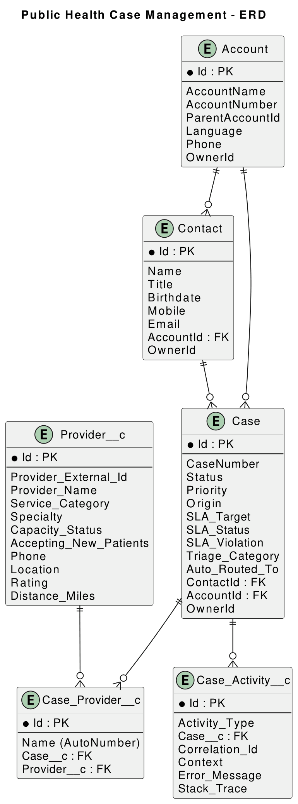
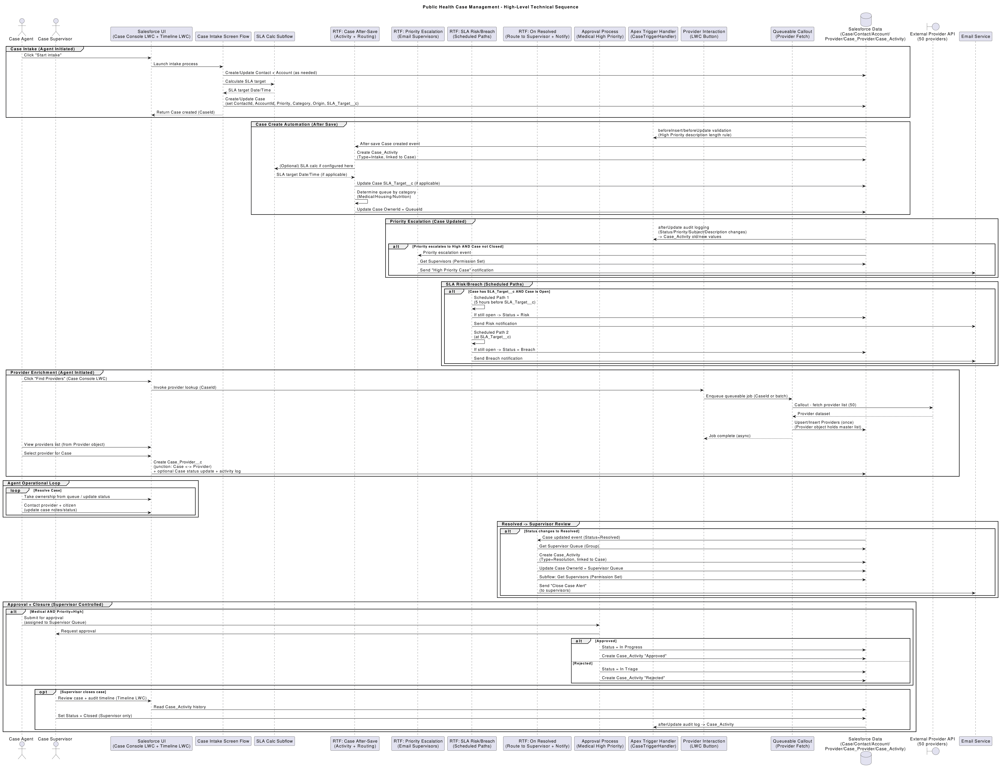

# 📘 Public Health Case Management System

## 📑 Table of Contents

* [Architecture](#architecture)

  * [Overview](#overview)
  * [Core Data Model](#core-data-model)
  * [Automation Layer](#automation-layer)
  * [Apex Layer](#apex-layer)
  * [UI Layer](#ui-layer)
  * [End-to-End Technical Flow](#end-to-end-technical-flow)
  * [Integration Architecture](#integration-architecture)
  * [Non-Functional Design](#non-functional-design)
* [Security Model](#security-model)

  * [Roles & Personas](#roles--personas)
  * [Object-Level Security](#object-level-security)
  * [Record-Level Access](#record-level-access)
  * [Field-Level Security](#field-level-security)
  * [Business Rule Enforcement](#business-rule-enforcement)
* [Deployment Steps](#deployment-steps)
* [ERD](#erd)
* [Sequence Diagram](#sequence-diagram)

---

# Architecture

## Overview

This application implements a centralized public health case management platform that supports:

**Intake → Triage → Routing → Enrichment → Resolution → Approval → Closure → Reporting**

The system replaces manual, inconsistent case handling processes with a structured, automated workflow.

The **Case** object serves as the system of record. All lifecycle events, routing decisions, SLAs, provider enrichment, approvals, and audit history are anchored to the Case object.

---

## Core Data Model

### Primary Object

### Case

Represents a citizen service request.

Responsibilities:

* Status and priority tracking
* SLA deadlines
* Queue routing
* Provider assignment
* Approval state
* Audit linkage

---

### Supporting Objects

#### Account

Represents a household or organization.

#### Contact

Represents the citizen/requestor.
Linked to both Account and Case.

#### Case_Activity__c

Audit log object used to record:

* Intake
* Routing
* Status changes
* Approval decisions
* Provider selection
* Errors
* SLA events

Supports compliance and timeline visualization.

#### Provider__c

Stores provider data retrieved from an external API.

#### Case_Provider__c

Junction object connecting:

```
Case 1 —— * Case_Provider__c * —— 1 Provider__c
```

Enables:

* Multiple provider options per case
* Provider selection
* Historical traceability

---

## Automation Layer

### Screen Flow – Case Intake

Triggered manually by the Agent.

Handles:

* Citizen lookup or creation
* Account linking or creation
* Case data capture
* SLA calculation
* Case creation
* Routing to correct queue

---

### SLA Calculation Subflow

Calculates SLA target based on priority:

* High → +24 hours
* Medium → +48 hours
* Low → +72 hours

---

### Record-Triggered Flows

#### On Case Create

* Logs intake activity
* Routes case to appropriate queue

#### On Priority Escalation

* Sends email notification to supervisors

#### On Status = Resolved

* Logs resolution activity
* Routes case to supervisor queue
* Sends “Close Case” alert

#### SLA Scheduled Paths

* 5 hours before SLA → Status = Risk
* At SLA target → Status = Breach
* Sends corresponding notifications

---

### Approval Process

Medical + High Priority cases require Supervisor approval.

* Approved → Status = In Progress
* Rejected → Status = In Triage
* Logged to Case_Activity__c

---

## Apex Layer

### CaseTriggerHandler.cls

Implements:

* High-priority description validation rule
* Field change audit logging for:

  * Status
  * Priority
  * Subject
  * Description

---

### Case_ExternalProviderService (Queueable)

Responsible for:

* Performing HTTP callout via Named Credential
* Retrieving external provider dataset
* Persisting providers to Provider__c
* Creating Case_Provider__c records
* Preventing duplicates
* Ensuring bulk safety

---

## UI Layer (Lightning Web Components)

### CaseConsole LWC

* Displays case list
* Displays case detail
* Executes provider lookup
* Assigns providers to cases

### CaseTimeline LWC

* Displays Case_Activity__c history
* Serves as full audit trail view

---

## End-to-End Technical Flow

### Create Case

1. Agent launches Intake Flow.
2. Contact and Account created or linked.
3. SLA calculated.
4. Case persisted.
5. Intake activity logged.
6. Case routed to queue.

---

### Work Case

1. Agent claims case from queue.
2. Agent clicks “Find Providers.”
3. Queueable Apex calls external API.
4. Providers persisted and linked.
5. Agent selects provider.
6. Status updated to Resolved.
7. Flow routes case to supervisor queue.

---

### Supervisor Review & Closure

1. Supervisor receives notification.
2. Reviews case timeline.
3. Approves high-priority medical cases.
4. Closes case.
5. Closure logged in Case_Activity__c.

---

## Integration Architecture

### External Provider API

* Accessed via Named Credential.
* Queueable Apex performs callout.
* Retrieves provider dataset (50 records).
* Inserts/updates Provider__c.
* Links to Case via Case_Provider__c.

### Failure Handling

* Errors logged to Case_Activity__c.
* No SOQL/DML in loops.
* Bulk-safe operations.

---

## Non-Functional Design

### Bulk Safety

* Collection-based DML
* No SOQL inside loops
* Queueable for callouts

### Governor Limit Strategy

* Single callout per queueable execution
* Pre-query for deduplication
* Controlled field updates

### Error Handling

* Centralized error handler
* Correlation IDs stored
* Logged to Case_Activity__c

### Extensibility

* New categories via Record Types
* SLA rules easily adjustable
* Routing logic centralized
* Provider logic isolated

---

# Security Model

## Roles & Personas

### Case Agent

* Create/edit cases
* Run intake flow
* Assign providers
* Resolve cases
* Cannot close cases
* Cannot approve high-priority medical cases

### Supervisor

* All agent capabilities
* Approve/reject cases
* Close cases
* Monitor SLA compliance
* View audit history

---

## Object-Level Security

Permission Sets:

* Case_Agent
* Case_Supervisor

CRUD permissions configured for:

* Case
* Case_Activity__c
* Case_Provider__c
* Provider__c
* Contact
* Account

---

## Record-Level Access

* Case OWD: Private
* Access via ownership and queue membership
* Supervisors have broader visibility via role hierarchy

---

## Field-Level Security

Sensitive fields restricted appropriately:

* SLA fields
* Closure-related fields
* Audit fields

---

## Business Rule Enforcement

Declarative:

* Validation rules for closure control
* Approval process enforcement
* Flow routing and SLA

Apex:

* Description length validation
* Audit logging
* Supervisor-only close guardrails

---

# Deployment Steps

(See previous section in documentation.)

---

# ERD

See:

```
/
```

---

# Sequence Diagram

See:

```
/
```

This diagram shows:

Flow → Apex → External API → LWC → Supervisor → Approval Engine


